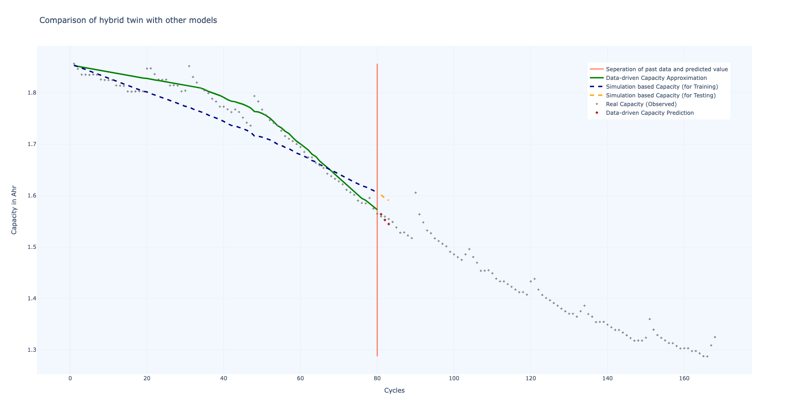
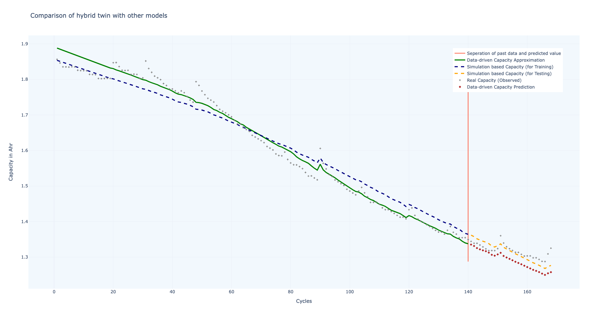

## A small practice of establishing Digital Twin

The case and concept are introduced in the reference [How to Build a Digital Twin in Python](https://towardsdatascience.com/how-to-build-a-digital-twin-b31058fd5d3e). where I directly take the dataset, equations and codes of plot part in use, but I reconstruct the codes of neural networkr part with `pytorch` (in the reference, `keras` is used).

## Concept and approach

This is a simple realization of one concept of digital twin. Generally speaking the `hybrid digital twin` :

- `Physical world` corresponds to `real data` (mostly from measurements/sensors)
- `Virtual world` corresponds to `simulation data` (noted as physics-based/equation-based/model-driven)
- `Twin` perspective corresponds to `evaluated/predicted data` (realized through statistics/neural network)

The reference mentioned above uses the approach:

- `Real data` of `physical worl` comes from a open database recording the relation of battery capacity (life) and discharge cycle
- `Simulation data` of `virtual world` is based on experience equation
- `Twin data` is evaluated/predicted based on a trained neural network that takes `simulation data` as input and `difference between simulation data and real data` as output/label

## Code use

- Install python libraries described in `requirements.txt`
- Run `python main.py`

## Demo 

### Example 1

A neural network model is trained based on the real data of 1 - 80 cycles. Using the model to generate the twin data for next three steps.

### Example 2

A neural network model is trained based on the real data of 1 - 140 cycles. Using the model to generate the twin data for rest steps.

### Simple conclusion

The approach can contribute by following the change between real data and simulation data. It is more effective than either learning the real data or learning the simulation data. Or in other word, `physics-infomred`. However, certain consideration still need to be made due to the complex of real situation, e.g. adjustment of twin data for more precise result.

## Usefullness

It is a simple practice to understand the approach. Many real case problems and factors are not involved. Therefore:

:no_entry_sign: It can not be directly considered as a solution, many efforts are not existing, e.g. neural network model design, learning rate configuration, error treatment, motst important, the twin data post-processing.

:white_check_mark: It is more a template of approach know-how and can be elaborated specifically for certain engineering/research case

:white_check_mark: It is promising to combine system simulation with neural network towards physics-informed form of digital twin

